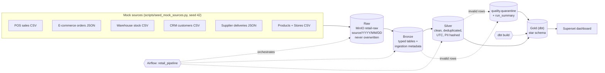

# RetailLake - Smart Retail Data Platform


Turns messy, scattered retail data (POS, e-commerce, warehouse, CRM, suppliers)
into clean, trusted, dashboard-ready tables using a medallion architecture.
Runs entirely on one laptop with Docker Compose. Built as the CCA Data Engineer
8-week individual internship project.

**The idea in one line:** load everything, keep the raw files untouched, clean
into Silver, quarantine (never hide) bad rows, model a star schema in Gold, and
let the dashboard read *only* Gold.

## Who it is for

| User | Needs | Gets |
|---|---|---|
| Business Manager | sales, revenue and product trends without touching files | Superset dashboard on the Gold layer |
| Inventory Planner | stockout / low-stock risk from daily snapshots | stockout table (`gold.inventory_flat`) |
| Data Reviewer | can the data be trusted? what was rejected and why? | quality scorecard + quarantine summary |

## Architecture



| Layer | Stores | Rule |
|---|---|---|
| Raw | exact source files in MinIO, `retail-raw/<source>/YYYY/MM/DD/` | never edited or overwritten; a changed file for the same date lands beside the original |
| Bronze | typed Postgres tables (`bronze.*`) | adds `_source_file`, `_ingested_at`, `_run_date`; no business logic |
| Silver | clean tables (`silver.*`) | validate, resolve product ids, standardise to UTC, trim text, hash PII, deduplicate; failures go to quarantine |
| Gold | dimensions + facts (`gold.*`) | shaped for dashboard queries; the dashboard reads nothing else |

More detail: [`docs/architecture.md`](docs/architecture.md).

## Quick start

Requirements: Docker Desktop (with WSL2 on Windows), Git, Python 3.11+. On Windows
run the `make` commands from a WSL terminal, or use the plain commands shown
next to each step.

```bash
git clone https://github.com/Ravindi373/smart-retail-data-platform.git
cd smart-retail-data-platform
cp .env.example .env          # then edit .env - see "Configuration" below
make demo                     # start stack -> seed -> full pipeline -> quality summary
```

`make demo` is just these steps; run them individually if you prefer:

| Step | Make | Plain command |
|---|---|---|
| Start the stack | `make up` | `cd docker && docker compose --env-file ../.env up -d` |
| Generate mock data | `make seed` | `pip install -r scripts/requirements.txt && python scripts/seed_mock_sources.py` |
| Raw + Bronze | `make bronze` | `docker exec retaillake-airflow-scheduler airflow dags test retail_bronze_ingestion <YYYY-MM-DD>` |
| Silver | `make silver` | `docker exec retaillake-airflow-scheduler airflow dags test retail_silver_clean <YYYY-MM-DD>` |
| Gold + all dbt tests | `make gold` | `docker exec retaillake-dbt dbt build` |
| Quality summary | `make quality` | see `Makefile` |
| Stop | `make down` | `cd docker && docker compose down` |

You can also run the whole Airflow part from the UI: open http://localhost:8080,
trigger **`retail_pipeline`** (it runs Bronze, waits, then Silver). Then run
`make gold`.

| Service | URL |
|---|---|
| Airflow | http://localhost:8080 |
| MinIO console | http://localhost:9001 |
| Superset | http://localhost:8088 |
| Postgres | localhost:5432, database `retaildb` |

First-time Superset setup (one time): see
[`setup-notes/WEEK6_SETUP_NOTES.md`](setup-notes/WEEK6_SETUP_NOTES.md).

### Re-running is safe

* Same date twice: raw objects are skipped when identical, Bronze rows for that date are replaced. Nothing is duplicated.
* A different date (what `@daily` does): Bronze keeps each load, and Silver is built from the **latest** load of each source, so the data is never counted twice.

## The Gold star schema

| Table | Grain | Notes |
|---|---|---|
| `dim_customer` | one row per customer | email/phone stored only as hashes; no loyalty programme = `none` |
| `dim_product` | one row per product | unified catalogue with SKU mapping |
| `dim_store` | one row per store/warehouse | region from the store master |
| `dim_date` | one row per calendar day (2020-2030) | year, month, quarter, weekday, weekend flag |
| `fact_sales_transaction` | one row per sales line item | POS and online (order items unnested) |
| `fact_inventory_snapshot` | one row per product, location, day | `is_stockout_risk` = on hand <= reorder point |
| `quality_summary` | one row per source + failed rule | quarantine counts |
| `quality_scorecard` | one row per source | rows in / clean / quarantined / pass rate |
| `sales_flat`, `inventory_flat` | same as their fact | dashboard views: fact joined to its dimensions |

ERD: [`docs/erd.md`](docs/erd.md).

## Data quality

Bad data is detected at Silver, moved to `quality.quarantine` with the original
record and a reason, and counted on the dashboard. The mock sources deliberately
contain every issue the brief lists: missing values, duplicates, invalid
prices/quantities, mixed timestamp formats, different product identifiers,
future-dated orders and invalid emails. Full rule catalogue with counts:
[`docs/data_quality.md`](docs/data_quality.md).

## Dashboard

Superset dashboard reading only Gold: daily sales trend, revenue by channel, top
products by net sales, stockout / low-stock table, data quality summary; filters
for date range, sales channel, store / region, product category and loyalty
tier. Screenshots are in [`evidence/`](evidence/).

## Testing and CI

```bash
pip install -r requirements-dev.txt
make lint     # ruff
make test     # 92 unit tests, no Docker needed
make e2e      # real DAGs + dbt against Postgres (needs the services; see tests/e2e)
```

GitHub Actions (`.github/workflows/ci.yml`) runs lint, unit tests, a Compose-file
check, a secrets check, and the end-to-end pipeline (Airflow DAGs + dbt on Postgres
with an S3 emulator) on every push. `dbt build` runs 10 models and 38 tests
(everything passes except 1 documented warning).

## Repository layout

```
dags/                 retail_pipeline (master), retail_bronze_ingestion, retail_silver_clean
src/connectors/       storage.py  - idempotent, immutable raw landing (MinIO/S3)
src/db/               db.py       - connection + idempotent DDL
src/quality/          rules.py    - validation / cleaning helpers (pure, unit-tested)
dbt_smart_retail/     Gold models, schema tests, singular tests
scripts/              seed_mock_sources.py - repeatable mock data generator
data/sample/          generated source files + _manifest.json (committed for reviewers)
docker/               docker-compose.yml, Postgres init SQL, dbt profile, Superset config
tests/                unit/, dags/, e2e/
docs/                 architecture, ERD, sources, data quality, troubleshooting, demo, defence prep
setup-notes/          week-by-week build notes
evidence/             dated screenshots per week
```

## Configuration

Copy `.env.example` to `.env`. Never commit `.env`. Every value in
`.env.example` is a placeholder.

| Variable | Purpose |
|---|---|
| `POSTGRES_USER/PASSWORD/DB` | app database `retaildb` |
| `MINIO_ROOT_USER/PASSWORD/ENDPOINT` | object storage credentials |
| `AIRFLOW_FERNET_KEY` | encrypts Airflow connections (generate; command in the file) |
| `AIRFLOW_ADMIN_USER/PASSWORD` | Airflow UI login |
| `SUPERSET_SECRET_KEY` | Superset session signing (generate) |
| `PII_HASH_SALT` | secret salt for the email/phone hashes (generate; keep it stable) |
| `SEED_RANDOM_SEED` | mock data seed (default 42) |

## Installed versions

Record the versions you actually ran before submitting (unpinned images move):

| Component | Version | How to check |
|---|---|---|
| Python (host) | 3.11+ | `python --version` |
| Docker Compose | *fill in* | `docker compose version` |
| PostgreSQL | 16 | `docker exec retaillake-postgres postgres --version` |
| Apache Airflow | 2.9.3 (pinned) | `docker exec retaillake-airflow-scheduler airflow version` |
| MinIO | *fill in* (image `minio/minio`) | `docker exec retaillake-minio minio --version` |
| dbt-core / dbt-postgres | 1.8.x | `docker exec retaillake-dbt dbt --version` |
| Apache Superset | *fill in* (image `apache/superset:latest`) | `docker exec retaillake-superset superset version` |

## Design decisions and known limitations

* **Full-refresh Silver.** Rebuilt each run from the latest Bronze load. Simple and safe at this scale; production would use incremental merge.
* **"Future-dated" = after the source extract time** (`data/sample/_manifest.json`), not after today, so results are reproducible.
* **Timestamps are assumed UTC** at the source; mixed formats are parsed, not time-zone shifted.
* **Customer referential gap.** 27 customers with an invalid email are quarantined, so their 338 sales lines (2.74% of net sales) have no `dim_customer` row. The dbt relationship test reports it as a warning and the dashboard labels them `unknown`.
* **dbt runs in its own container**, triggered by `make gold`, not by Airflow, to avoid dependency conflicts with the pinned Airflow image.
* **Sources are generated files**, not live systems. In production the landing step would call real APIs / database exports; everything after it is unchanged.
* **Dashboard views** (`sales_flat`, `inventory_flat`) are views, not materialised tables; instant at 12k rows, would be incremental tables at scale.
* **Raw PII exists in Raw and Bronze by design** (they preserve the source exactly); hashing starts in Silver, so Silver, Gold and the dashboard never hold a raw email or phone. The data is generated, not real. In production, Raw/Bronze access would be restricted or the fields encrypted.
* **Local only.** Secrets live in `.env`; no cloud deployment.

## Documentation

[`docs/architecture.md`](docs/architecture.md) · [`docs/erd.md`](docs/erd.md) ·
[`docs/source_systems.md`](docs/source_systems.md) · [`docs/data_quality.md`](docs/data_quality.md) ·
[`docs/TROUBLESHOOTING.md`](docs/TROUBLESHOOTING.md) · [`docs/DEMO_SCRIPT.md`](docs/DEMO_SCRIPT.md) ·
[`docs/DEFENCE_PREP.md`](docs/DEFENCE_PREP.md) · [`docs/CHANGES_WEEK7_8.md`](docs/CHANGES_WEEK7_8.md)
