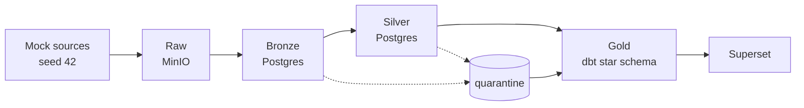

# Architecture

## Flow 

Sources -> Raw (MinIO) -> Bronze (typed) -> Silver (clean) -> Gold (star schema) -> Superset dashboard

Bad rows are pulled aside into a quarantine table during the Silver step
instead of being dropped silently.

## Layer rules

| Layer | What it stores | Main rule |
|---|---|---|
| Raw | Exact source files, unmodified | Never edit or overwrite. Date-partitioned: `retail-raw/<source>/YYYY/MM/DD/` |
| Bronze | Typed source tables | Add ingestion metadata (`_source_file`, `_ingested_at`, `_run_date`) and an audit row per load |
| Silver | Clean, trusted data | Validate, resolve product ids, standardise timestamps/text, hash PII, deduplicate |
| Gold | Facts and dimensions | Optimised for dashboard queries only |

**Hard rule:** no dashboard chart reads from Raw, Bronze or Silver. Everything
customer-facing comes from Gold.

## Why this shape

- **Raw preserves the original.** If a cleaning rule turns out to be wrong we
  can reprocess from Raw instead of having destroyed the source data. The
  storage connector enforces this: identical content is skipped, changed
  content is landed next to the original, nothing is overwritten.
- **Bronze separates "loaded" from "trustworthy."** Typing and metadata happen
  here, but no business logic - this keeps ingestion code and cleaning code
  from tangling together.
- **Silver is the only place cleaning logic lives.** One place to look when a
  business user asks "why does this record look different from the source file".
- **Gold is deliberately narrow.** Only the tables a dashboard needs, at the
  grain a dashboard needs, so query logic in Superset stays simple.

## Orchestration

| DAG | Schedule | Does |
|---|---|---|
| `retail_pipeline` | `@daily` | the single entry point: runs Bronze, waits, runs Silver, passing the same run date down |
| `retail_bronze_ingestion` | none (triggered) | lands the 7 source files in MinIO, parses them into Bronze, writes an audit row per source |
| `retail_silver_clean` | none (triggered) | products first, then the other sources in parallel, then logs a quality report |

The Gold layer is built by dbt (`make gold`), in its own container.

## Re-run behaviour

- **Same date again:** raw objects with identical content are skipped; Bronze rows for that `_run_date` are deleted and re-inserted. No duplicates.
- **A new date:** Bronze keeps each load. Silver reads only the latest load of each source (`WHERE _run_date = max(_run_date)`), because each extract is a full snapshot. Without this the same records would be counted twice.
- **Silver** is a full refresh (TRUNCATE + rebuild) inside one transaction per source; a failure rolls back and leaves the previous Silver intact.

## Key design decisions

| Decision | Reason | Trade-off |
|---|---|---|
| Full-refresh Silver | simple, always consistent at this scale | production would use incremental merge |
| "Future-dated" measured against the source extract time | reproducible whenever the pipeline runs | needs the extract time from the source (manifest here) |
| Product identifiers resolved against `silver.products` (id or SKU) | POS and e-commerce send SKUs; the master keys on product_id | unresolvable ids are quarantined, not guessed |
| PII hashed with SHA-256 + secret salt in Silver | Gold and the dashboard never see raw email/phone; salt blocks lookup-table reversal | salt must be kept stable or hashes change |
| dbt outside Airflow | avoids dependency conflicts with the pinned Airflow image | Gold is triggered by `make gold`, not by the DAG |
| Quarantine in Postgres, not a separate bucket | queryable with SQL and surfaced on the dashboard | not an immutable audit store |

See `docs/erd.md` for the Gold-layer star schema this architecture feeds.
