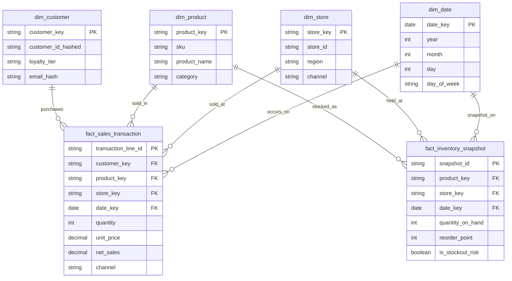

# Gold layer ERD (draft — Week 1)

Star schema: two fact tables, four dimensions. This will be built as dbt
models in `dbt_smart_retail/models/gold/` from Week 5 onward. Grain and
keys below are a first draft and may change once Silver cleaning reveals
real data shapes.

## Grain

- `fact_sales_transaction`: one row per sales line item (one product within
  one order/transaction)
- `fact_inventory_snapshot`: one row per product, per store/warehouse, per
  snapshot date

## Notes / decisions to confirm with mentor

- `channel` lives on both `dim_store` and the fact table temporarily —
  decide in Week 5 whether channel is a store attribute or its own
  dimension (a store can sell both in-person and online).
- PII (`email_hash`, `customer_id_hashed`) is hashed in Silver, never
  stored raw in Gold.
- `is_stockout_risk` is a derived/calculated column, not a raw source
  field — logic to be defined against `reorder_point` in Week 5.
