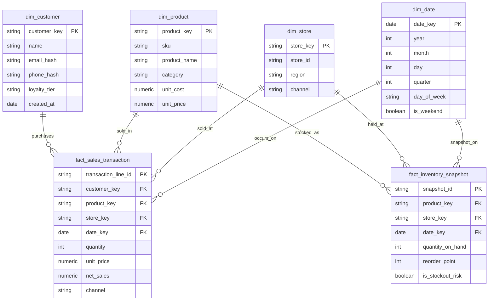

# Gold layer ERD

Star schema: two fact tables, four dimensions, built as dbt models in
`dbt_smart_retail/models/gold/`.

## Grain

- `fact_sales_transaction`: one row per sales line item (one product within one POS transaction or online order)
- `fact_inventory_snapshot`: one row per product, per store/warehouse, per snapshot date

## Decisions

- `channel` is kept on the fact table (in_store / online / mobile_app) and on `dim_store` (always `in_store`): an online order has no physical store, so `store_key` is legitimately NULL for online sales.
- PII (`email_hash`, `phone_hash`) is hashed in Silver and never stored raw in Gold.
- `is_stockout_risk` is derived: `quantity_on_hand <= reorder_point`.
- `net_sales` = `quantity x unit_price` (checked by a dbt test).
- Customers without a loyalty membership are labelled `none` in `dim_customer`. A sale whose customer is missing from the dimension is labelled `unknown` in `sales_flat` (see Known limitations in the README).

## Extra Gold tables (not part of the star)

`quality_summary` (quarantine counts per source and rule), `quality_scorecard` (pass rate per source), and the dashboard views `sales_flat` / `inventory_flat`.
